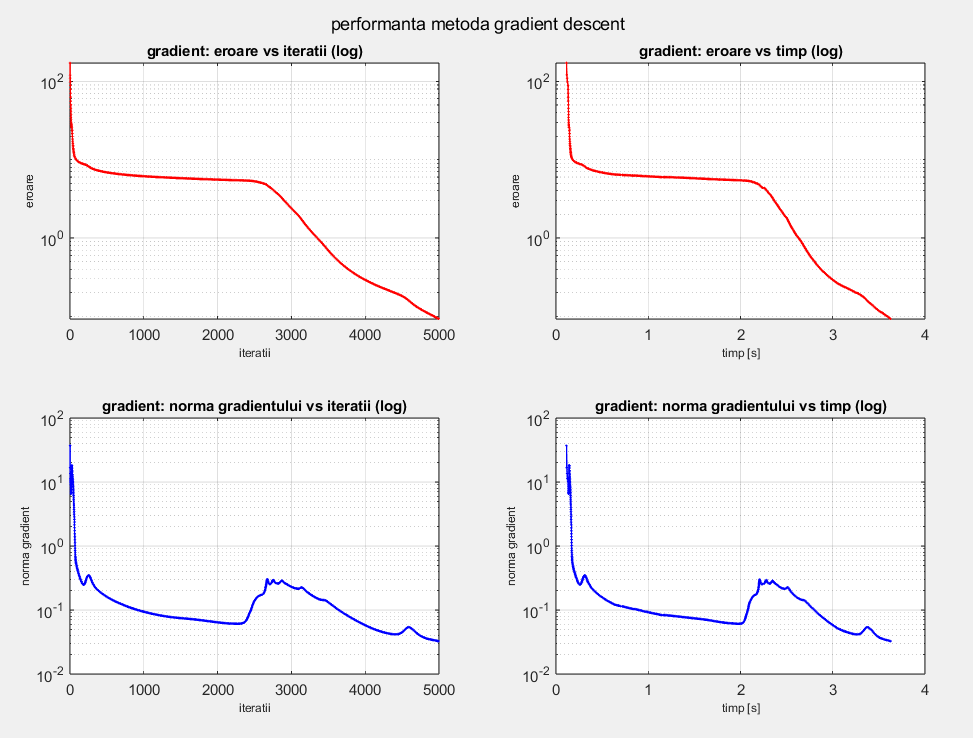
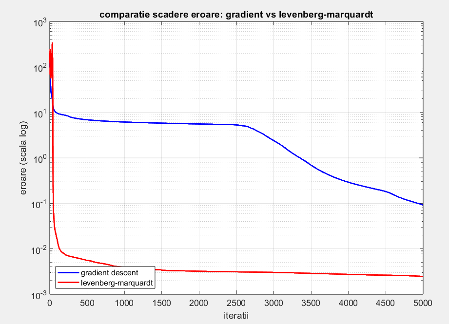

# Problema de optimizare neconstrânsă în învățarea aprofundată

Se tratează o problemă de regresie în contextul învățării profunde. Scopul este estimarea rezistenței la înaintare a unui yacht pe baza caracteristicilor geometrice.

## 📊 Descriere

- **Sarcina de învățare**: regresie
- **Date folosite**: Yacht Hydrodynamics – UCI ML Repository
- **Caracteristici**:
  - lungime relativă la deplasare
  - volum de deplasare
  - raport lungime/lățime
  - raport lățime/adâncime
  - coeficient de blocaj carena
  - număr Froude (viteză fără dimensiuni)
    
**Targetul** il reprezinta **rezistenta totala** la inaintarea yachtului.

## 🧪 Preprocesare

- Standardizare Z-score
- Shuffle aleator
- Split 80/20 pentru train/test
- Adăugare bias la intrari

## 🧠 Algoritmi implementați

### Gradient Descent Batch
- Funcție activare: sigmoid scalata si deplasata
- Rată învățare: 0.1
- 50 neuroni în stratul ascuns
- Max 5000 iter.
- Prag oprire: `1e-6`

### Levenberg-Marquardt
- Pentru regresie non-liniara
- Corectia parametrilor se calculeaza prin rezolvarea unui sistem liniar la fiecare iteratie.
- Lambda inițial: 1
- 50 neuroni
- Max 5000 iter.
- Prag oprire: `1e-6`

## 📈 Rezultate

| Algoritm               | R²     | MSE     |
|------------------------|--------|---------|
| Gradient Descent       | 0.9950 | 1.0279  |
| Levenberg-Marquardt    | 0.9989 | 0.2283  |

🔍 **Observații**:
- Levenberg-Marquardt converge mai rapid și are erori mai mici.
- GD necesită mai multe iterații.
- Alegerea a 50 de neuroni este un compromis bun între capacitate și stabilitate.

## 🖼️ Exemple vizuale

